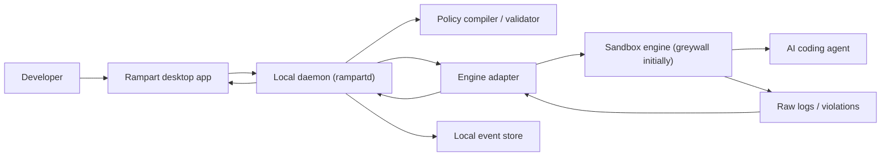

# Rampart architecture

## Purpose

Rampart is a local-first blast-radius limiter for AI coding agents. It gives developers and teams a practical control plane for what an agent can touch, where it can connect, and how its actions are recorded. The product exists because current AI coding tools inherit the full permissions of the developer session, while most teams lack deterministic controls, audit visibility, and a reliable kill path.

This document turns the research and product thesis into a buildable architecture.

## Problem statement

AI coding agents can:
- read sensitive files such as `.env`, SSH keys, cloud credentials, or project secrets
- modify files outside the intended workspace
- make network requests with developer or project context
- continue acting after the user has lost context on what they are doing

Existing products skew toward:
- post-hoc review
- generic LLM gateways
- enterprise governance layers

The product gap is an enforcement-first developer tool that works at the execution layer.

## Product goals

### Primary goals
- Launch supported AI agents inside a least-privilege environment.
- Make blocked behavior visible in real time.
- Let users choose or refine policies without editing low-level sandbox rules directly.
- Preserve a local-first, low-friction experience for solo developers.
- Create a path to team-wide policy sharing and auditability.

### Secondary goals
- Support multiple agent tools behind one product workflow.
- Keep enforcement engine pluggable.
- Build trust through transparent, inspectable decisions and limitations.

### Non-goals
- Full cross-platform parity in v1.
- Generic model observability for prompts/responses.
- Cloud-required workflows in the free product.
- Replacing endpoint security, EDR, or enterprise identity systems.

## Target users

### Primary
- Individual developers using agentic coding tools daily.
- Engineering teams of roughly 5 to 50 developers.
- Engineering managers who want policy and evidence without heavy enterprise rollout.

### Later
- Platform/security teams standardizing local agent controls.
- CI and automation environments running headless agent tasks.

## Proposed repo architecture

The current repository is nearly empty. Build toward a workspace split that keeps enforcement, policy logic, and UX separate.

```text
rampart/
|- AGENTS.md
|- docs/
|  |- architecture.md
|  |- adr/
|  |- threat-model.md
|  `- roadmap.md
|- apps/
|  `- desktop/
|- crates/
|  |- rampartd/
|  |- policy-core/
|  `- engine-greywall/
`- packages/
   `- shared-ui/
```

## High-level system design



## Main components

## 1. Desktop app

Likely stack:
- Tauri
- TypeScript for UI
- Rust bridge where needed

Responsibilities:
- project/workspace selection
- agent selection
- profile selection
- session launch UX
- real-time event and violation display
- local history browsing
- policy editing UX
- settings and engine diagnostics

Why this layer exists:
- This is the product surface users trust or reject.
- The value is not only blocking actions; it is making enforcement understandable and operationally usable.

## 2. Local daemon (`rampartd`)

Likely stack:
- Rust
- internal local API for desktop communication
- SQLite for session/event storage

Responsibilities:
- resolve selected project, agent, profile, and environment
- validate launch requests
- construct engine-specific runtime configuration
- spawn and supervise sandboxed sessions
- normalize and persist events
- stream live state to desktop clients
- own capability detection per OS

Why this layer exists:
- Keeps system/process logic out of the UI.
- Creates a stable internal contract even if the GUI changes.
- Provides a future headless path for CLI or CI support.

## 3. Policy core

Responsibilities:
- canonical policy schema
- profile inheritance and overrides
- validation and conflict detection
- compile abstract policy to engine-specific config
- normalize enforcement results into product-level concepts

Policy areas:
- filesystem scope
- allowed write roots
- temporary-file behavior
- network policy
- process/command restrictions
- environment redaction or pass-through rules

Design principle:
- Users should edit product concepts, not raw sandbox syntax.

## 4. Engine adapter

Initial adapter approach:
- keep `engine-greywall` for macOS/Linux support and reference behavior
- leave room for a Windows-first adapter or engine path without restructuring the product

Responsibilities:
- discover the engine binary
- verify compatible version
- translate compiled policy into runtime arguments/config files
- parse stdout/stderr/log streams
- map raw engine output to Rampart event types
- report unsupported features precisely

Why an adapter boundary matters:
- reduces lock-in to one upstream project
- allows maintained forks or alternate engines later
- keeps product logic independent from engine quirks

## 5. Sandbox engine

Initial engine strategy:
- Windows-first product delivery means the enforcement engine must be abstracted from the start
- `greywall` is still valuable as the first documented macOS/Linux engine path
- Windows may require a different runtime or implementation path entirely

Role:
- actual enforcement of filesystem, syscall, and network boundaries using OS-specific primitives

Rampart should treat the engine as:
- authoritative for what was technically enforced
- versioned and capability-scoped
- something that may differ by platform

## Key workflows

## Workflow A: Start a sandboxed session

1. User picks project.
2. User picks agent and profile.
3. Desktop sends launch request to daemon.
4. Daemon resolves environment and validates policy.
5. Policy core compiles the profile.
6. Engine adapter translates policy to engine config.
7. Daemon starts the engine and child agent process.
8. Desktop shows active session status immediately.

Success criteria:
- launch latency is low enough to feel native
- failures are actionable and specific

## Workflow B: Handle a violation

1. Agent attempts blocked access.
2. Engine emits raw violation/log data.
3. Adapter parses and normalizes the event.
4. Daemon stores it and streams it to the desktop app.
5. Desktop explains:
   - what was attempted
   - why it was blocked
   - what policy allowed or denied it
6. User can inspect or revise policy safely.

Success criteria:
- violations are understandable by a developer in seconds
- the user never mistakes a partial capability for full protection

## Workflow C: Create or refine a profile

1. User starts from a preset for a tool/workflow.
2. User narrows allowed paths and network behavior.
3. Policy core validates constraints.
4. Desktop previews the likely impact.
5. User saves locally.

Later extension:
- signed shared profiles distributed to team members

## Data model

Core entities:
- `Project`
- `AgentTool`
- `Profile`
- `CompiledPolicy`
- `Session`
- `ViolationEvent`
- `AuditEvent`
- `EngineCapabilitySnapshot`

Example conceptual relationships:
- a project can have many profiles
- a profile can be used across many sessions
- a session emits many events
- an engine capability snapshot informs what policy features are actually enforceable

## Platform strategy

## Windows

Priority:
- primary target platform
- first platform that product workflows should feel complete on

Expected strengths:
- strong relevance for enterprise and mixed-team developer environments
- clear differentiation if local agent controls are usable on the platform most teams already deploy

Risks:
- different enforcement primitives than macOS/Linux
- higher implementation complexity if no existing engine maps cleanly to product needs
- risk of overpromising before the Windows runtime strategy is proven

## macOS

Priority:
- second-wave platform after the Windows model is validated

Expected strengths:
- meaningful local developer market
- viable app/tray distribution path

Expected limitations:
- possible feature gaps relative to Linux
- network enforcement/visibility may lag Linux

Rule:
- never market macOS as having parity unless it actually does

## Linux

Priority:
- second-wave platform after Windows
- likely strongest technical benchmark for deep enforcement

Expected strengths:
- mature low-level controls
- better long-term story for deep filesystem and network restrictions

Risks:
- path/rename semantics
- complexity of low-level troubleshooting
- product value may skew too technical if Linux becomes the default mental model

## Security model

Rampart has three layers of trust:

1. Product policy layer
- what the user intends to allow

2. Product orchestration layer
- how Rampart compiles, launches, records, and explains behavior

3. Enforcement layer
- what the engine and OS actually block or allow

Important principle:
- Rampart must distinguish between intended policy and verified enforcement.

If the engine cannot enforce a rule on a platform, the product should say so directly and downgrade or reject that policy.

## Observability model

Local-first observability should include:
- session start/stop
- attempted file access
- blocked writes
- network attempt summaries
- policy version used
- engine version used
- user actions that changed policy

Do not overbuild this into a generic analytics platform early. The point is operational trust and explainability.

## UX principles

- Default-deny, but not opaque-deny.
- Explain the exact rule behind a block.
- Show platform capability gaps before the user hits them.
- Optimize for the first 5 minutes of value:
  - install
  - choose project
  - launch agent safely
  - see one meaningful event
- Avoid enterprise jargon in the core user flow.

## Risks and architectural pressure points

## 1. Upstream dependency risk

If the product depends heavily on greywall behavior or CLI format:
- adapter brittleness increases
- release compatibility becomes a product issue

Mitigation:
- version checks
- adapter tests
- documented compatibility matrix
- maintainable fork strategy if needed

## 2. Cross-platform inconsistency

If Windows, macOS, and Linux differ materially:
- support burden rises
- trust drops if the UX implies parity

Mitigation:
- capability detection
- platform-specific docs and copy
- honest feature matrices

## 3. Security theater risk

If the UI promises broad safety without real enforcement:
- trust collapses

Mitigation:
- map every visible protection claim to a verified engine capability

## 4. Policy complexity

Low-level sandbox controls are hard for users to reason about.

Mitigation:
- presets
- safe defaults
- narrow user-facing abstractions
- rich explanations instead of raw policy syntax

## 5. Performance and friction

If launch/setup overhead is too high:
- users bypass the product

Mitigation:
- thin orchestration
- fast startup
- cached engine checks
- minimal mandatory configuration

## Suggested implementation phases

## Phase 0: foundation
- finalize product language
- scaffold repo and workspace layout
- define policy schema
- define event schema
- write threat model
- document capability matrix assumptions

## Phase 1: local MVP
- desktop shell
- daemon
- greywall adapter
- project/agent/profile picker
- session launch
- live violation stream
- local session history

Outcome:
- one developer can use Rampart daily on supported machines

## Phase 2: policy UX
- editable presets
- policy diffing
- better diagnostics
- local recommendations from past violations

Outcome:
- product moves from wrapper to usable workflow tool

## Phase 3: team mode
- shared profiles
- audit sync
- org-level policy bundles
- basic admin view

Outcome:
- manager or team lead can standardize usage

## Phase 4: expanded surfaces
- CI/headless mode
- alternate engines
- enterprise integrations where justified

## Immediate next files to add after this doc

- `docs/threat-model.md`
- `docs/roadmap.md`
- `docs/adr/0001-workspace-layout.md`
- nested `AGENTS.md` files once `apps/`, `crates/`, and `packages/` exist

## Decision summary

The correct first architecture for Rampart is:
- local-first
- desktop-led
- daemon-backed
- policy-driven
- adapter-based
- Windows-first
- honest about platform limits

That shape matches the research context, preserves the strongest product wedge, and leaves room for team and enterprise expansion without compromising the initial developer workflow.
