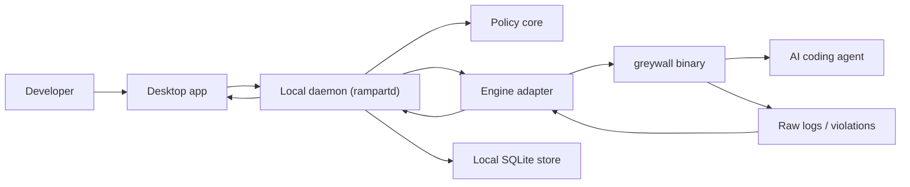

# Rampart architecture

## Purpose

Rampart is a local-first blast-radius limiter for AI coding agents. It lets developers launch supported agents inside a constrained execution environment, observe blocked and allowed activity, and refine policy without editing low-level sandbox syntax.

This document describes the product architecture reflected by the current product direction: Windows-first desktop delivery, a replaceable enforcement layer, `greywall` retained as a reference adapter for macOS/Linux rather than the product's primary runtime assumption, and a hosted control plane reserved for team and enterprise workflows rather than for the core individual product.

## Product scope

Rampart is designed to solve a specific problem:

- AI coding agents inherit broad local permissions
- teams lack deterministic controls at the execution layer
- blocked behavior is rarely explained clearly
- there is often no practical local audit trail or stop path

Rampart is not intended to be:

- a prompt or content filtering product
- a generic observability platform
- an enterprise governance suite before the local product is solid

## Core architecture decisions

| Decision | Current choice | Notes |
|---|---|---|
| Desktop shell | Tauri | Native tray, installer, and local integration fit the product shape |
| UI stack | TypeScript + React | Fast UI iteration for onboarding, session view, and policy editing |
| Local orchestration | Rust | Strong fit for process management, engine integration, and reliability |
| Persistence | SQLite | Local-first storage for sessions, alerts, profiles, and settings |
| Hosted control plane | Optional, separate service | Team audit aggregation, hosted policy coordination, alerts, admin workflows |
| Initial enforcement path | Windows-first runtime behind an engine abstraction | The product model cannot assume `greywall` is the Windows path |
| macOS/Linux enforcement path | `greywall` via adapter | Treat as a binary dependency, not an imported library |
| Supported platforms in v1 | Windows first | Capability differences must be surfaced in product behavior |

## Repo architecture

```text
rampart/
|- AGENTS.md
|- docs/
|  |- architecture.md
|  |- PRD.md
|  |- roadmap.md
|  |- threat-model.md
|  `- adr/
|- apps/
|  `- desktop/
|- crates/
|  |- rampartd/
|  |- policy-core/
|  `- engine-greywall/
`- packages/
   `- shared-ui/
```

## High-level system design



## Main components

## 1. Desktop app

Responsibilities:

- onboarding and engine diagnostics
- project selection
- agent detection and selection
- profile/template picker
- live session state and violation view
- session history browsing
- policy editing UX
- alerts, tray actions, and user-visible explanations
- frontend shell lives in `apps/desktop/`
- native Tauri host crate lives in `apps/desktop/src-tauri/`

Product shape:

- the desktop app should initially feel like a launch-and-control shell for agent sessions
- users choose a project, choose an installed agent, choose a profile, and launch through Rampart
- the desktop is the place to see live session state, blocked actions, explanations, and history
- the first version should not assume Rampart replaces the agent's own UI with a fully custom chat experience
- terminal-first users should still be considered first-class users through launch integration now and CLI/headless support later

Rules:

- do not construct sandbox commands in the UI
- do not embed engine-specific logic in view code
- clearly surface unsupported capabilities per platform

## 2. Local daemon (`rampartd`)

Responsibilities:

- validate launch requests from the desktop app
- resolve project, agent, environment, and profile
- compile user policy into runtime configuration
- launch and supervise sandboxed sessions
- collect, normalize, and persist events
- stream live session updates to the UI
- own capability detection and diagnostics
- provide a clean bridge to any later hosted sync surfaces without moving enforcement into the cloud

Why it exists:

- isolates process and persistence logic from the GUI
- creates a stable internal API for future desktop and CLI clients
- enables a later headless mode without re-architecting the product

## 3. Policy core

Responsibilities:

- canonical policy schema
- profile templates and overrides
- validation and conflict detection
- compilation into engine-ready configuration
- normalization of enforcement outcomes into product concepts

User-facing policy concepts should stay above raw sandbox syntax. The user should edit:

- filesystem scope
- writable roots
- network policy
- process boundaries
- reusable profile templates

The product should not expose raw `greywall` YAML as the default authoring surface.

## 4. Engine adapter (`engine-greywall`)

Responsibilities:

- discover and validate the `greywall` binary
- check version compatibility
- translate compiled Rampart policy into runtime arguments and config
- parse stdout, stderr, and event streams
- normalize engine output into Rampart event types
- report capability gaps precisely

Design rule:

- keep the adapter boundary narrow and explicit so upstream engine changes do not leak through the entire product

## 5. Enforcement engine

Initial engine strategy:

- Windows-first delivery means the primary runtime may differ from `greywall`
- `greywall` remains the current reference engine for macOS/Linux paths

Rampart treats the engine as:

- authoritative for what was technically enforced
- capability-scoped by platform
- replaceable in future

This matters because platform behavior is not identical. For example:

- Windows will require different enforcement primitives than macOS/Linux
- Linux may support richer network capture or blocking paths than macOS
- temporary files and rename flows may behave differently from the user's intent
- unsupported rules must be rejected or downgraded explicitly

## Core workflows

## Primary desktop workflow

1. User opens Rampart and sees current capability status for the machine.
2. User selects a local repository or project.
3. User selects an installed agent such as Claude Code, Codex, Aider, Goose, or OpenCode.
4. User accepts a suggested profile or chooses an existing profile.
5. User launches the session through Rampart.
6. Desktop shows live session state, event stream, blocked action count, and explanations.
7. User stops the session or reviews it later in local history.

This workflow should drive navigation and screen design ahead of broader dashboard concepts.

## Workflow A: launch a sandboxed session

1. User selects a project, agent, and profile.
2. Desktop sends a launch request to the daemon.
3. Daemon validates the request and loads the saved or selected policy.
4. Policy core compiles the abstract policy.
5. Engine adapter translates that policy into `greywall` launch configuration.
6. Daemon starts the engine and agent process.
7. Desktop immediately shows active session state, capability status, and live events.

Success conditions:

- launch is low-friction
- engine failures are actionable
- the user can tell what platform protections are active

## Workflow B: handle a blocked action

1. Agent attempts a blocked operation.
2. The engine emits a raw event.
3. The adapter parses and normalizes the event.
4. The daemon stores it and streams it to the desktop app.
5. The desktop app explains:
   - what was attempted
   - why it was blocked
   - which policy rule applied
   - whether the current platform has any relevant limitation

Success conditions:

- blocked behavior is understandable in seconds
- the UI never overstates what was enforced

## Workflow C: create or refine a profile

1. User starts from a preset template.
2. Rampart auto-detects likely project type when possible.
3. User refines allowed paths or network behavior through product-level controls.
4. Policy core validates the result.
5. The desktop app persists the profile locally and reuses it for future sessions.

Later extension:

- repository-backed policy import/export through `.rampart/policy.json`
- optional hosted policy distribution and review for paid team workflows

## Data model

Core entities:

- `Project`
- `AgentTool`
- `Profile`
- `CompiledPolicy`
- `Session`
- `ViolationEvent`
- `AuditEvent`
- `Alert`
- `EngineCapabilitySnapshot`

Representative session fields:

- session id
- started and ended timestamps
- agent name
- project directory
- profile name
- files read
- files written
- files blocked
- network domains allowed
- network domains blocked
- blocked action count
- terminated-by-user state

## Platform model

## Windows

Priority:

- primary target platform
- first platform that product workflows should feel complete on

Rules:

- keep the enforcement layer abstract enough that the Windows runtime is not coupled to macOS/Linux assumptions
- do not defer core product workflows behind non-Windows engine work

## macOS

Priority:

- second-wave platform after the Windows model is validated

Rules:

- document network limitations clearly
- never imply parity with Windows or Linux unless verified

## Linux

Priority:

- second-wave platform after Windows
- likely strongest benchmark for deep enforcement and later headless/CI flows

Rules:

- use Linux as the richest low-level capability benchmark where justified
- document filesystem and rename limitations clearly

## Security model

Rampart has three distinct trust layers:

1. Product policy layer
- what the user intended to allow

2. Product orchestration layer
- how Rampart compiles, launches, records, and explains behavior

3. Enforcement layer
- what the engine and OS actually blocked or allowed

Important rule:

- Rampart must distinguish intended policy from verified enforcement

If a rule cannot be enforced on the current platform, the product should say so directly.

## Observability model

Local-first observability should include:

- session start and stop
- filesystem access summaries
- blocked operations
- network attempt summaries where supported
- policy version used
- engine version used
- alerts and user-triggered termination events

The purpose is operational trust, not generic analytics.

Hosted observability, when enabled for paid teams, should aggregate metadata across users without becoming a dependency for the core single-user enforcement loop.

## Terminal-user model

Rampart should support two closely related ways of working:

1. Desktop-led launch
- a user opens Rampart, picks project, agent, and profile, then launches a session

2. Terminal-led execution
- a user normally works in a terminal with tools such as Claude Code or Codex
- Rampart later provides a CLI or headless entry point so those users can keep their workflow while still getting enforced launch, policy selection, and audit visibility

The product should not force all users into a custom chat surface in order to benefit from the enforcement layer.

## Known technical risks

## 1. Atomic write and rename behavior

Problem:

- some sandboxed write flows use temporary files and later rename into the workspace

Implication:

- path-scoped intent and syscall-level enforcement may diverge

Response:

- prefer directory-level policy guidance
- document limitations clearly
- test negative paths explicitly

## 2. macOS network limitations

Problem:

- network capture and enforcement may be weaker than Linux

Response:

- show limited network status in product UI and docs
- do not market parity where it does not exist

## 3. Upstream dependency risk

Problem:

- `greywall` is an upstream project with its own release cadence and constraints

Response:

- adapter version checks
- compatibility tests
- maintainable fork path if required

## 4. Trust failure through overstated claims

Problem:

- a security product loses credibility if the UI implies protections that are not actually enforced

Response:

- every visible protection claim must map to a verified capability

## Suggested implementation order

## Phase 0

- repo scaffolding
- architecture and threat docs
- policy and event schema design
- engine capability framing

## Phase 1

- desktop shell
- local daemon
- `greywall` adapter
- project and profile selection
- session launch
- live event stream

## Phase 2

- editable presets
- local history
- better diagnostics
- safer policy refinement

## Phase 3

- local alerts
- persistent audit history
- repository-backed policy import/export
- hosted team sync boundaries

## Phase 4

- headless and CI flows
- broader engine support
- enterprise features where justified
